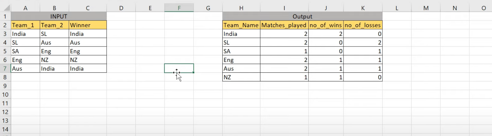
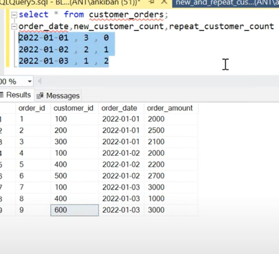

# Data-Engineering-Practise

# SQL questions
1. [Build the league table](#Build-the-league-table)
2. [Repeat customers and new Customers](#Repeat-customers-and-new-Customers)
3. [Resources used in the different floors of the office building](#Resources-used-in-the-different-floors-of-the-office-building)
4. [Unbanned riders/customers trips](#Unbanned-riders/customers-trips)

## Build the league table

URL :  [Question](https://www.youtube.com/watch?v=qyAgWL066Vo&list=PLBTZqjSKn0IeKBQDjLmzisazhqQy4iGkb)

## Repeat customers and new Customers

URL :  [Question](https://www.youtube.com/watch?v=MpAMjtvarrc&list=PLBTZqjSKn0IeKBQDjLmzisazhqQy4iGkb&index=2)

## Resources used in the different floors of the office building

URL :  [Question](https://www.youtube.com/watch?v=P6kNMyqKD0A&list=PLBTZqjSKn0IeKBQDjLmzisazhqQy4iGkb&index=3)

## Unbanned riders/customers trips
URL :  [Question](https://www.youtube.com/watch?v=EjzhMv0E_FE&list=PLBTZqjSKn0IeKBQDjLmzisazhqQy4iGkb&index=7)

# Concepts 
1. [window functions rows clause](#sql-window-functions-rows-clause)

## sql-window-functions-rows-clause
URL : [Concept](https://learnsql.com/blog/sql-window-functions-rows-clause/)
